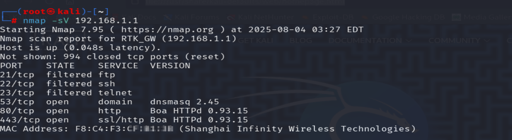
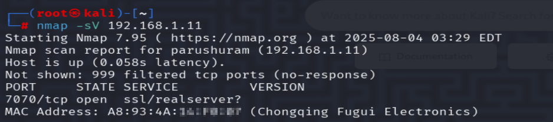
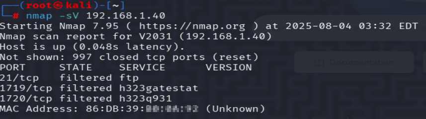

#  Network Scan - Task 1: Local Network Port Scanning

##  Objective
Perform a local network scan using Nmap to identify active hosts, open ports, and exposed services to evaluate basic network security posture.

---

##  Tools Used
- **Nmap** (Port scanning)
- **Kali Linux** (Operating System)
- **Screenshot tool** (Visual documentation)

---

##  Network Details
- **Scanned Range**: `192.168.1.0/24`
- **Total Hosts Detected**: 13

---

##  Scan Screenshots

| Description             | Screenshot |
|-------------------------|------------|
| Full Network Scan       | [Full Network Scan](scan_result.txt) |
| Host: 192.168.1.1       |  |
| Host: 192.168.1.11      |  |
| Host: 192.168.1.40      |  |

---

##  Detailed Findings

###  192.168.1.1 (RTK_GW)
- **Open Ports**: 53, 80, 443
- **Services Detected**:
  - DNS: `dnsmasq 2.45`
  - Web Server: `Boa HTTPd 0.93.15`
- **Observations**:
  - Web admin panel exposed on HTTP and HTTPS
  - Boa HTTPd is **outdated** and vulnerable to known exploits
  - MAC Address (masked): `F8:C4:F3:XX:XX:XX`

---

###  192.168.1.11
- **Open Port**: 7070 (SSL RealServer or unidentified SSL service)
- **Observations**:
  - Possibly a **media server** or **IoT device**
  - MAC Address (masked): `A8:93:4A:XX:XX:XX`

---

###  192.168.1.40 (V2031)
- **No open ports**, but filtered ports suggest:
  - Port 1719: H.323 Gatekeeper (VoIP)
  - Port 1720: H.323 Signaling (Video calling systems)
- **Observations**:
  - May be a **VoIP** or **video conferencing** endpoint
  - MAC Address (masked): `86:DB:39:XX:XX:XX`

---

##  Conclusion

The scan revealed a typical small network with a variety of devices:
- Some running **outdated services** (Boa HTTPd)
- Others exposing **unknown or filtered ports**
- No critical remote-access ports (like SSH, Telnet) were open

 **Recommendations**:
- Update or replace outdated services (e.g., Boa HTTPd)
- Limit web admin interface access with firewall rules
- Monitor devices exposing uncommon or unidentified ports
- Regular internal scanning for network hygiene

---

 **Repo Files Included**
- `scan_result.txt`: Full scan output
- Screenshots of each scan
- This `README.md` as a task summary

---

